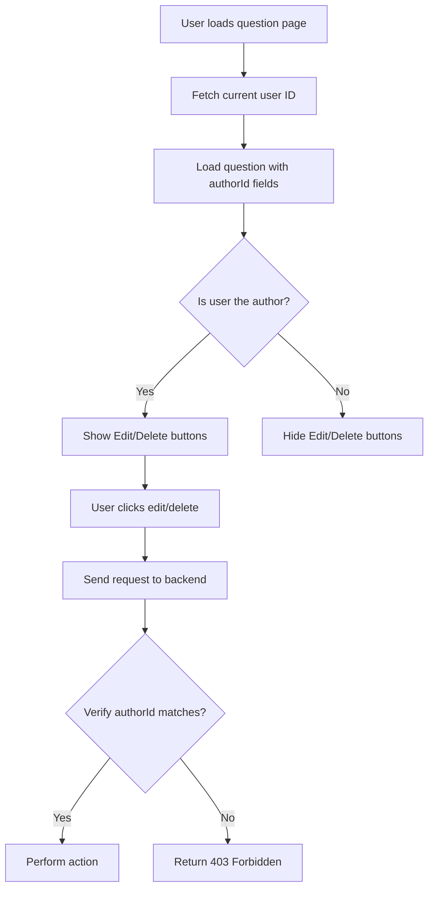

# Question & Answer Edit/Delete Feature

## Overview
This document describes the implementation of edit and delete functionality for questions and answers in the MentorStack application.

## Features Implemented

### 1. Backend API Endpoints (questions.ts)

#### Question Endpoints
- **PUT `/api/questions/:id`** - Update a question
  - Only the author can edit their question
  - Validates title (min 10 chars) and body (min 20 chars)
  - Supports updating tags
  - Returns 403 if non-author attempts to edit
  
- **DELETE `/api/questions/:id`** - Delete a question
  - Only the author can delete their question
  - Cascading delete handles related records (answers, votes, bookmarks, tags)
  - Returns 403 if non-author attempts to delete

#### Answer Endpoints
- **PUT `/api/questions/:questionId/answers/:answerId`** - Update an answer
  - Only the author can edit their answer
  - Validates content (min 20 chars)
  - Returns updated answer with vote counts
  - Returns 403 if non-author attempts to edit

- **DELETE `/api/questions/:questionId/answers/:answerId`** - Delete an answer
  - Only the author can delete their answer
  - Cascading delete handles related votes
  - Returns 403 if non-author attempts to delete

### 2. Frontend API Client (auth-api.ts)

Added new methods to the AuthAPI class:
- `updateQuestion(questionId, data)` - Update a question
- `deleteQuestion(questionId)` - Delete a question
- `updateAnswer(questionId, answerId, content)` - Update an answer
- `deleteAnswer(questionId, answerId)` - Delete an answer

Updated interfaces:
- `Question` interface now includes `authorId` field
- `Answer` interface now includes `authorId` field

### 3. Frontend UI (questions/[id]/page.tsx)

#### Question Edit/Delete UI
- **Edit button** - Opens inline editor with title and body inputs
- **Delete button** - Shows confirmation dialog before deletion
- **Save/Cancel buttons** - Appear when editing
- **Authorization** - Buttons only visible to question author
- **Visual feedback** - Disabled states during submission

#### Answer Edit/Delete UI
- **Edit button** - Replaces answer content with textarea
- **Delete button** - Shows confirmation dialog before deletion
- **Save/Cancel buttons** - Appear when editing
- **Authorization** - Buttons only visible to answer author
- **Inline editing** - Smooth transition between view and edit modes

## Authorization Flow

## Security Features

1. **Frontend Authorization Checks**
   - Buttons only visible to content authors
   - Uses current user ID comparison

2. **Backend Authorization Checks**
   - All edit/delete endpoints verify author ownership
   - Returns 403 Forbidden for unauthorized attempts
   - Validates user identity via JWT token

3. **Confirmation Dialogs**
   - Delete actions require user confirmation
   - Prevents accidental deletions

4. **Data Validation**
   - Title: minimum 10 characters
   - Question body: minimum 20 characters
   - Answer content: minimum 20 characters

## Database Schema Support

The Prisma schema already supports these operations:
- `authorId` field in Question and Answer models
- Cascade delete configured via `onDelete: Cascade`
- Author relations via `@relation` fields

## User Experience

### Editing a Question
1. Click edit button (pencil icon)
2. Title and body become editable
3. Make changes
4. Click "Save Changes" or "Cancel"
5. Question updates instantly

### Deleting a Question
1. Click delete button (trash icon)
2. Confirm deletion in dialog
3. Question deleted and redirected to questions list

### Editing an Answer
1. Click edit button (small pencil icon)
2. Answer becomes textarea
3. Make changes
4. Click "Save Changes" or "Cancel"
5. Answer updates instantly

### Deleting an Answer
1. Click delete button (small trash icon)
2. Confirm deletion in dialog
3. Answer removed from list

## Icons Used (lucide-react)
- `Edit` - Edit button
- `Trash2` - Delete button
- `Save` - Save changes button
- `XCircle` - Cancel button

## Error Handling

### Frontend
- Shows alert on API errors
- Prevents multiple submissions with loading states
- Validates input before submission

### Backend
- Returns appropriate HTTP status codes:
  - 400: Validation errors
  - 403: Authorization errors
  - 404: Resource not found
  - 500: Server errors
- Includes error messages in response

## Testing Checklist

- [ ] Question author can edit their question
- [ ] Question author can delete their question
- [ ] Non-authors cannot see edit/delete buttons
- [ ] Backend rejects unauthorized edit attempts
- [ ] Backend rejects unauthorized delete attempts
- [ ] Answer author can edit their answer
- [ ] Answer author can delete their answer
- [ ] Tag updates work correctly
- [ ] Cascade deletes work properly
- [ ] Confirmation dialogs appear before deletion
- [ ] UI updates after successful operations
- [ ] Error messages display properly
- [ ] Validation works correctly

## Future Enhancements

1. **Edit History**
   - Track edit timestamps
   - Show "edited" indicator
   - View edit history

2. **Rich Text Editing**
   - Apply formatting toolbar to edit mode
   - Preview while editing

3. **Undo Delete**
   - Soft delete with recovery option
   - Time-limited undo period

4. **Admin Override**
   - Allow admins to edit/delete any content
   - Moderation features

5. **Edit Notifications**
   - Notify users when their content is edited
   - Track significant changes
